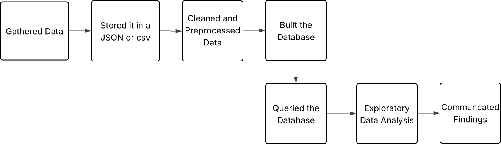
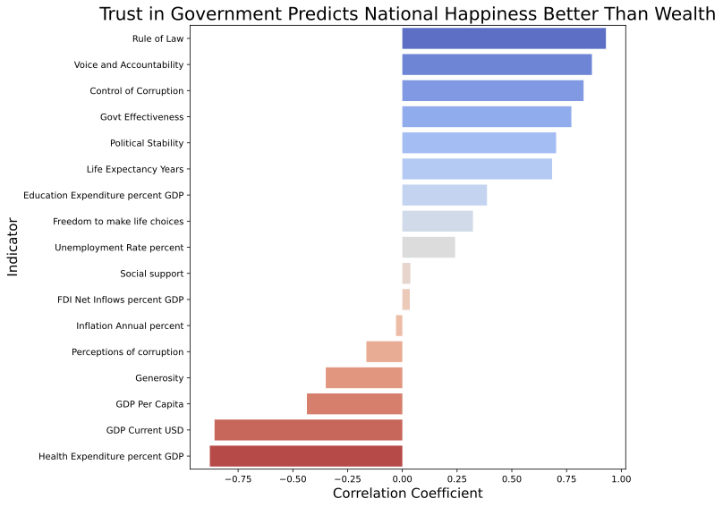
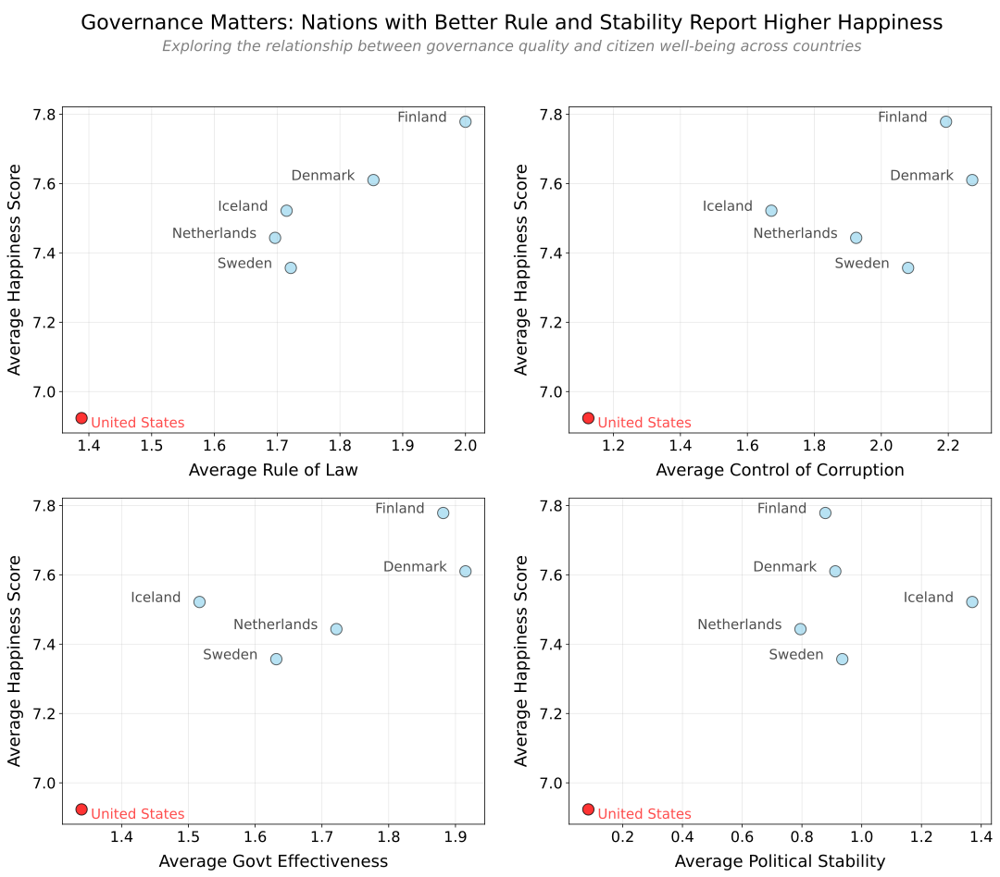

# Why Is the U.S. So Unhappy?

## Introduction

This project, which I completed for [ME204](https://lse-dsi.github.io/ME204/2025/), explores a simple but important question:  
**Why isn't the United States one of the happiest countries in the world, despite being one of the richest?**

Using seven years of global survey data from the World Happiness Reports, and socio-economic indicators from the World Bank API, I built a data pipeline to uncover what really explains national happiness. The U.S. consistently underperforms in global happiness rankings, and this project investigates why.

## What you will find in this website

1. [The U.S. Lags in Happiness, Despite Its Wealth](#1-the-us-lags-in-happiness-despite-its-wealth)
2. [Governance Could Predict Happiness Instead of GDP](#2-governance-could-predict-happiness-instead-of-gdp)
3. [The U.S. Governance Gap May Explain the Gap in Happiness](#3-the-us-governance-gap-may-explain-the-gap-in-happiness)

---

## Methodology & Justification

To answer this question, I merged two global datasets:

  
<strong>World Bank Variables (Click to expand)</strong>

- **GDP_Current_USD**: Total economic output measured in current U.S. dollars.  
- **Health_Expenditure_percent_GDP**: Share of a country's GDP spent on healthcare.  
- **Education_Expenditure_percent_GDP**: Share of a country's GDP allocated to education.  
- **Unemployment_Rate_percent**: Percentage of the labor force without work but actively seeking employment.  
- **Inflation_Annual_percent**: Year-over-year percentage change in consumer prices.  
- **FDI_Net_Inflows_percent_GDP**: Value of incoming foreign investments as a percentage of GDP.  
- **Population_Total**: Total number of people living in a country.  
- **Life_Expectancy_Years**: Average number of years a newborn is expected to live.  
- **Govt_Effectiveness**: Perception of public service quality, policy formulation, and implementation.  
- **Rule_of_Law**: Degree to which people have confidence in and abide by legal rules.  
- **Control_of_Corruption**: Extent to which public power is exercised for private gain.  
- **Political_Stability**: Likelihood of political unrest or violence affecting governance.  
- **Voice_and_Accountability**: Extent of citizen participation, freedom of expression, and free media.  
- **GDP_Per_Capita**: Economic output per person, measuring average income.

  
<strong>World Happiness Report Variables (Click to expand)</strong>

- **Year**: The year the happiness data was collected.  
- **Rank**: A country's overall position in the global happiness rankings.  
- **Country**: The name of the country.  
- **Happiness_Score**: Average life evaluation score on a scale from 0 to 10.  
- **Social_support**: Degree to which people feel they have support in times of need.  
- **Freedom_to_make_life_choices**: Perceived freedom to choose life’s course.  
- **Generosity**: National average of recent charitable behavior.  
- **Perceptions_of_corruption**: Public perception of corruption in government and business.

---

I focused on six countries: the United States, and the five highest-ranking countries from the 2024 Happiness Index report 
- Finland
- Denmark
- Iceland
- Sweden
- Netherlands

These countries consistently appeared in all seven years of data and offer a contrast in policy and institutional design.

## Data Collection and Processing
To obtain the [World Bank indicators](https://datahelpdesk.worldbank.org/knowledgebase/topics/125589), I used the World Bank API to fetch up-to-date economic data for each country from 2018-2024. This automated data pull ensured the data is current and realiable allowing me to collect many indicators across multiple years without manual download or entry.

I downloaded the [World Happiness Index Data](https://www.worldhappiness.report/data-sharing/) directly from the website via CSV's from 2020-2024. The data from 2018 and 2019 were downloaded from Kaggle, as it was not offered for download on the World Happiness Report Data Sharing site. However, to ensure validity, I cross referenced and checked every number to match up to the rankings both years on the [World Happiness Report rankings/data](https://data.worldhappiness.report/table), and they did, so I downloaded the csv's for [2018](https://www.kaggle.com/datasets/njlow1202/world-happiness-report-data-2018) and [2019](https://www.kaggle.com/datasets/anitaannah/world-happiness-report-2019).

I then loaded all this data into a clean, relational SQLite database, making it easy to query and merge across sources.

To manage this data, I built a clean SQLite database and automated a pipeline to extract, transform, and load the information.

The diagram below shows the pipeline I built to collect, process, and analyse this data:

## Findings

### 1. The U.S. Lags in Happiness, Despite Its Wealth

Despite its high GDP, the U.S. placed **23rd in 2024** in happiness, far behind the top 5 happiest countries

More importantly, the **gap is growing**. The happiest countries continue to sustain or increase their well-being, while the U.S. has trended downward in the rankings.

---

### 2. Governance Could Predict Happiness Instead of GDP

To figure out what actually drives happiness, I calculated correlations between every World Bank indicator and happiness scores across all countries and years.

The results show that the strongest correlations of happiness weren't economic, rather they were all about how well countries are governed:

- **Rule of Law** (ρ = 0.93)
- **Voice and Accountability** (ρ = 0.87)
- **Control of Corruption** (ρ = 0.83)
- **Government Effectiveness** (ρ = 0.77)
- **Political Stability** (ρ = 0.70)

However, economic indicators like GDP and Health Expenditure actually had negative correlations with happiness.

The U.S. underperforms on these governance metrics relative to the happiest countries, which helps explain its lower happiness scores, and what may consistently predict happiness

---

### 3. The U.S. Governance Gap May Explain the Gap in Happiness

Since governance mattered most, I looked at how the U.S. compared to the happiest countries on the four key governance indicators that correlated strongest with happiness.

The pattern was clear across all four plots. The happiest countries consistently cluster in the upper right, with high governance quality AND high happiness. The U.S., marked in red, sits noticeably lower on both dimensions every time.
It may not be about making and having enough money. Happiness could pertain to whether people trust their institutions, feel like the system is fair, and believe their government actually works for them.

## Conclusion

So why is the U.S. so unhappy?

It may not fully be about income or spending. It’s about **governance**. The happiest countries in the world aren’t just economically successful, but they’re **well-governed, politically stable, and trusted by their citizens**.

If the U.S. wants to rise in happiness rankings, having a great GDP isn’t enough. It may need to rebuild **public trust, institutional accountability, and effective governance**.

This project shows how public datasets, when combined and analyzed thoughtfully, can reveal the deeper structures behind society's well-being.
